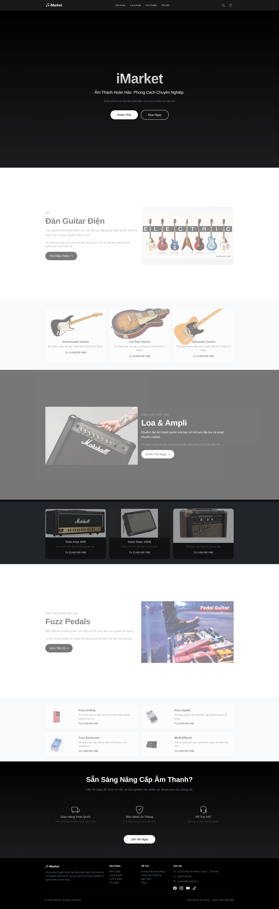
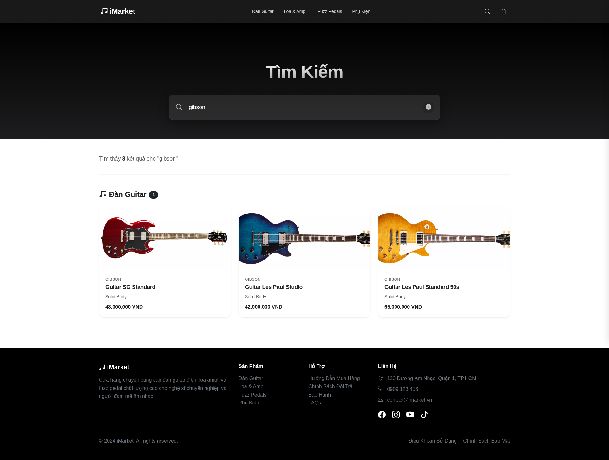
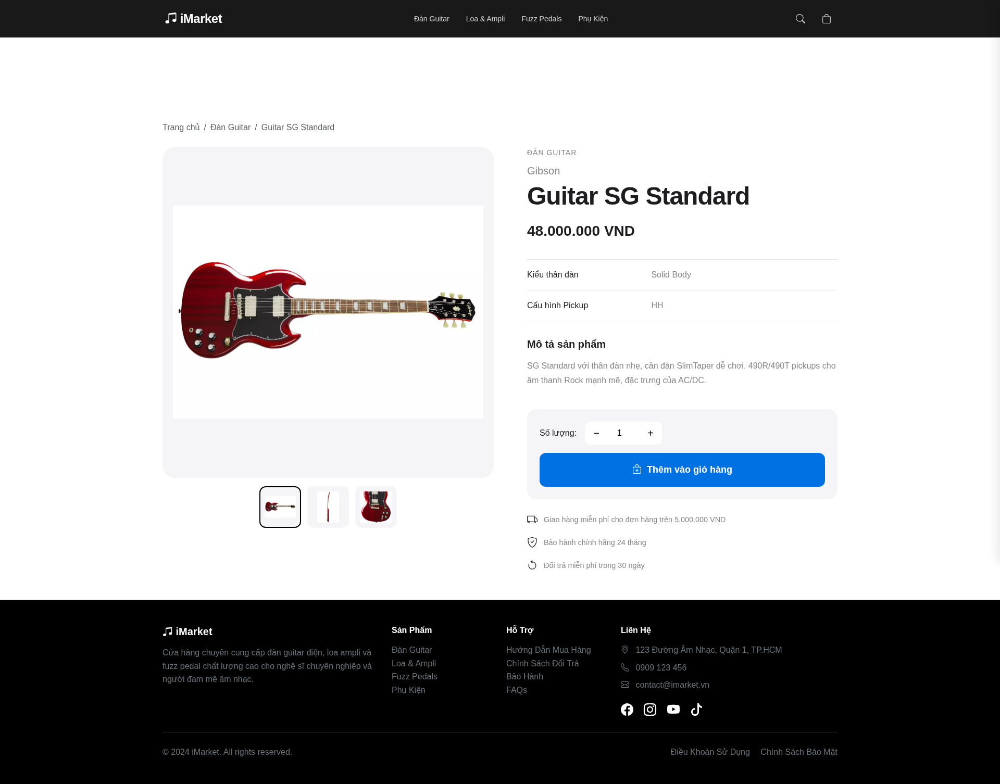
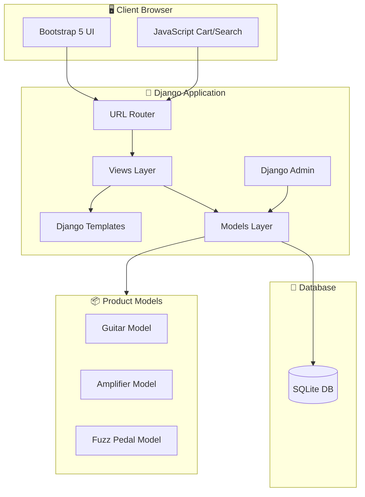
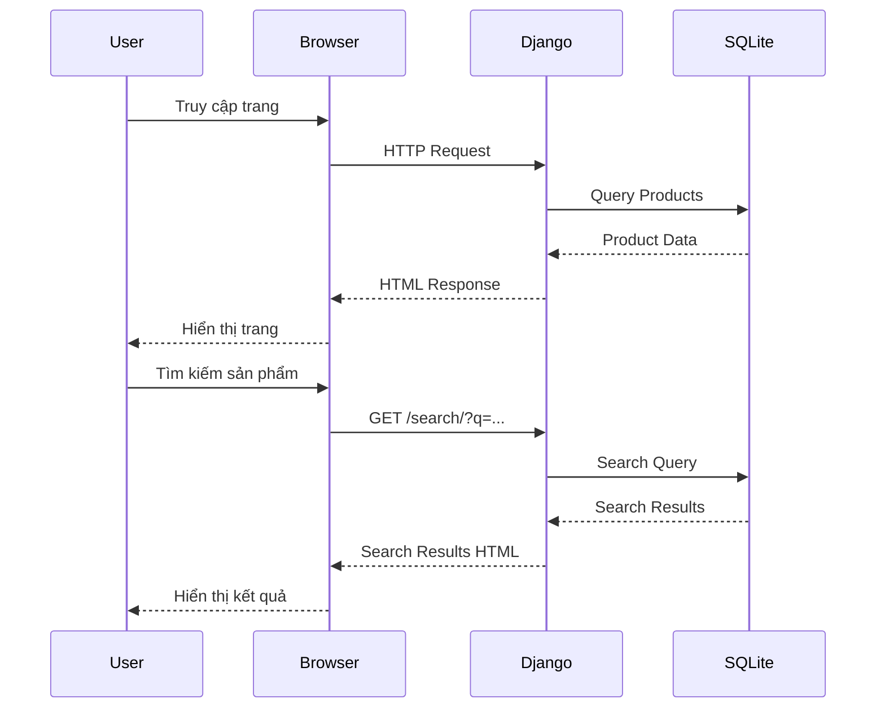

# iMarket

> Âm Thanh Hoàn Hảo. Phong Cách Chuyên Nghiệp.

Cửa hàng trực tuyến chuyên cung cấp đàn guitar điện, loa ampli và fuzz pedal chất lượng cao cho nghệ sĩ chuyên nghiệp và người đam mê âm nhạc.


## 📸 Screenshots

### Trang Chủ


*Giao diện trang chủ với hero section, danh mục sản phẩm (Đàn Guitar, Loa & Ampli, Fuzz Pedals) và các tính năng nổi bật*

### Trang Tìm Kiếm


*Tìm kiếm sản phẩm Gibson với autocomplete, hiển thị 3 kết quả: SG Standard, Les Paul Studio, Les Paul Standard 50s*

### Chi Tiết Sản Phẩm - Gibson SG Standard


*Trang chi tiết Gibson SG Standard: gallery ảnh sản phẩm, thông số kỹ thuật (Solid Body, HH pickups), mô tả sản phẩm, và nút thêm vào giỏ hàng*

## 📑 Mục Lục

- [Screenshots](#-screenshots)
- [Tính Năng](#-tính-năng)
- [Kiến Trúc Hệ Thống](#-kiến-trúc-hệ-thống)
- [Demo](#-demo)
- [Công Nghệ](#-công-nghệ)
- [Cài Đặt](#-cài-đặt)
- [Sử Dụng](#-sử-dụng)
- [Cấu Trúc Dự Án](#-cấu-trúc-dự-án)
- [Đóng Góp](#-đóng-góp)
- [Giấy Phép](#-giấy-phép)
- [Liên Hệ](#-liên-hệ)

## ✨ Tính Năng

### Danh Mục Sản Phẩm
- **Đàn Guitar Điện**: Stratocaster, Les Paul, Telecaster và nhiều dòng sản phẩm khác
- **Loa & Ampli**: Tube Amp, Solid State, Combo Practice với nhiều mức công suất
- **Fuzz Pedals**: Analog, Digital, Enclosure và Multi-Effects

### Tìm Kiếm Thông Minh
- Tìm kiếm toàn văn theo tên, thương hiệu, mô tả
- Gợi ý tự động (autocomplete) khi gõ từ khóa
- Lọc kết quả theo danh mục sản phẩm

### Giỏ Hàng
- Thêm/xóa sản phẩm vào giỏ hàng
- Cập nhật số lượng sản phẩm
- Lưu trữ giỏ hàng trong localStorage

### Giao Diện
- Thiết kế responsive, tương thích mọi thiết bị
- Giao diện hiện đại, lấy cảm hứng từ Apple
- Hỗ trợ tiếng Việt

## 🏗 Kiến Trúc Hệ Thống



### Luồng Xử Lý Request



## 🌐 Demo

Truy cập website: [https://imarket-production.up.railway.app](https://imarket-production.up.railway.app)

## 🛠 Công Nghệ

| Công Nghệ | Phiên Bản | Mô Tả |
|-----------|-----------|-------|
| [Django](https://www.djangoproject.com/) | 5.2.8 | Web framework Python |
| [Bootstrap](https://getbootstrap.com/) | 5.3.2 | CSS framework |
| [Bootstrap Icons](https://icons.getbootstrap.com/) | 1.11.1 | Icon library |
| [Gunicorn](https://gunicorn.org/) | 23.0.0 | WSGI HTTP Server |
| [SQLite](https://www.sqlite.org/) | 3.x | Database |

## 📦 Cài Đặt

### Yêu Cầu Hệ Thống

- Python 3.10 trở lên
- pip (Python package manager)

### Hướng Dẫn Cài Đặt

1. **Clone repository**

   ```bash
   git clone https://github.com/younglafire/imarket.git
   cd imarket
   ```

2. **Tạo virtual environment**

   ```bash
   python -m venv venv
   source venv/bin/activate  # Linux/macOS
   # hoặc
   venv\Scripts\activate     # Windows
   ```

3. **Cài đặt dependencies**

   ```bash
   pip install -r requirements.txt
   ```

4. **Chạy migrations**

   ```bash
   python manage.py migrate
   ```

5. **Khởi động server**

   ```bash
   python manage.py runserver
   ```

6. **Truy cập website**

   Mở trình duyệt và truy cập: [http://127.0.0.1:8000](http://127.0.0.1:8000)

## 🚀 Sử Dụng

### Tạo Admin User

```bash
python manage.py createsuperuser
```

### Truy cập Admin Panel

Truy cập [http://127.0.0.1:8000/admin](http://127.0.0.1:8000/admin) để quản lý sản phẩm.

### Thêm Sản Phẩm

1. Đăng nhập vào Admin Panel
2. Chọn loại sản phẩm (Guitars, Amplifiers, Fuzzes)
3. Điền thông tin sản phẩm và lưu

## 📁 Cấu Trúc Dự Án

```
imarket/
├── app/                    # Django app chính
│   ├── migrations/         # Database migrations
│   ├── static/            # Static files (CSS, JS, Images)
│   │   ├── css/
│   │   ├── js/
│   │   └── images/
│   ├── templates/         # HTML templates
│   │   ├── base.html
│   │   ├── index.html
│   │   ├── search.html
│   │   └── product_detail.html
│   ├── templatetags/      # Custom template filters
│   ├── admin.py           # Admin configuration
│   ├── models.py          # Database models (Guitar, Amp, Fuzz)
│   ├── urls.py            # URL routing
│   └── views.py           # View functions
├── imarket/               # Django project settings
│   ├── settings.py
│   ├── urls.py
│   └── wsgi.py
├── manage.py              # Django CLI
├── requirements.txt       # Python dependencies
├── Procfile              # Deployment configuration
└── README.md
```

## 🤝 Đóng Góp

Mọi đóng góp đều được hoan nghênh! Vui lòng làm theo các bước sau:

1. Fork repository
2. Tạo branch mới (`git checkout -b feature/AmazingFeature`)
3. Commit thay đổi (`git commit -m 'feat: add some AmazingFeature'`)
4. Push lên branch (`git push origin feature/AmazingFeature`)
5. Mở Pull Request

### Quy Ước Commit Message

Sử dụng [Conventional Commits](https://www.conventionalcommits.org/):

- `feat:` - Tính năng mới
- `fix:` - Sửa lỗi
- `docs:` - Thay đổi tài liệu
- `style:` - Định dạng code
- `refactor:` - Tái cấu trúc code
- `test:` - Thêm/sửa tests
- `chore:` - Các thay đổi khác

## 📄 Giấy Phép

Dự án này được phân phối theo giấy phép MIT. Xem file `LICENSE` để biết thêm chi tiết.

## 📞 Liên Hệ

- **Địa chỉ**: 123 Đường Âm Nhạc, Quận 1, TP.HCM
- **Điện thoại**: 0909 123 456
- **Email**: contact@imarket.vn

### Mạng Xã Hội

- Facebook: [@imarket](https://facebook.com)
- Instagram: [@imarket](https://instagram.com)
- YouTube: [@imarket](https://youtube.com)
- TikTok: [@imarket](https://tiktok.com)

---

<p align="center">
  Made with ❤️ by iMarket Team
</p>
